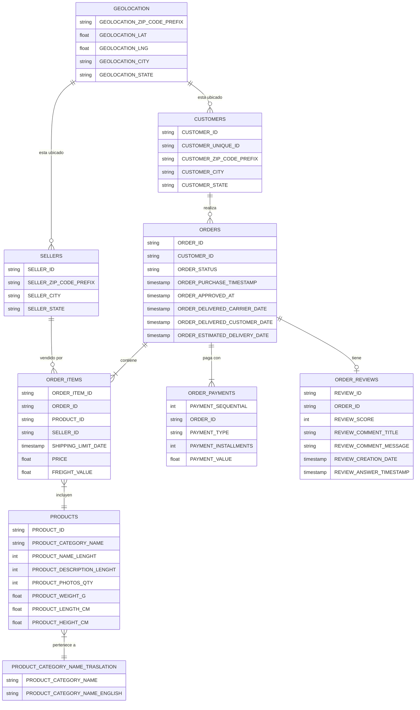

# Ecommify Database Design

Proyecto académico enfocado en el diseño conceptual, lógico y preliminar de la base de datos híbrida para **Ecommify**, una plataforma de comercio electrónico basada en PostgreSQL y MongoDB.

El objetivo principal es construir una arquitectura de datos escalable, consistente y flexible que soporte operaciones transaccionales (OLTP) y consultas analíticas (OLAP).

---

# Integrantes
- Sadane Geronimo Miguel Santiago Acevedo Virgues
- Julian Camilo Corredor Rojas
- Brayan Estif Calderon Gomez
- Yerlinson Maturana Serna 

---

# Objetivos del proyecto

- Diseñar un modelo entidad-relación normalizado en 3FN.
- Implementar un esquema relacional en PostgreSQL.
- Evaluar el uso de tipos avanzados como JSONB, arrays y ranges.
- Analizar extensiones de PostgreSQL como pg_trgm y PostGIS.
- Diseñar un módulo complementario en MongoDB.
- Aplicar criterios arquitectónicos usando el Teorema CAP.
- Definir una arquitectura híbrida SQL + NoSQL.

---

# Arquitectura utilizada

## PostgreSQL

Se utiliza para el módulo transaccional debido a:

- Soporte ACID.
- Integridad referencial.
- Manejo eficiente de relaciones complejas.
- Uso de constraints y normalización.
- Soporte para tipos avanzados y extensiones.

### Módulos en PostgreSQL

- Customers
- Orders
- Order Items
- Payments
- Sellers
- Products
- Reviews

---

## MongoDB

Se utiliza como complemento para:

- Información semiestructurada.
- Catálogo extendido de productos.
- Atributos dinámicos.
- Datos flexibles y escalables.

---

# Tecnologías utilizadas

| Tecnología | Uso |
|---|---|
| PostgreSQL 16 | Base de datos relacional |
| MongoDB | Base de datos NoSQL |
| Supabase | Plataforma PostgreSQL cloud |
| Google Colab | EDA y análisis |
| Python | Procesamiento de datos |
| SQL | Scripts DDL y consultas |
| GitHub | Control de versiones |

---

# Estructura del repositorio

```plaintext
Ecommify_Database_Design/
├── README.md
├── docs/
│   ├── Documento_Tecnico_Diseno.pdf
│   └── Presentacion_Ejecutiva.pdf
├── postgresql/
│   ├── schema/
│   ├── seed_data/
│   └── queries/
├── mongodb/
│   └── schema/
└── notebooks/
    └── Data_Exploration_Analysis.ipynb
```

# Comandos postgressql

- lo primero que se realiza en verificar la conexion

``` cli
chmod 600 database/postgresql/.env.supabase
export $(grep -v '^#' database/postgresql/.env.supabase | xargs)
```

- aplicar el esquema

``` cli
PGPASSWORD="$SUPABASE_DB_PASSWORD" psql "postgresql://$SUPABASE_DB_USER@$SUPABASE_DB_HOST:$SUPABASE_DB_PORT/$SUPABASE_DB_NAME?sslmode=require" -v ON_ERROR_STOP=1 -f database/postgresql/schema/schema.sql
```

la arquitectura apartir del cual nos inspiramos para realizar la base de datos relacional es la siguiente:



dando como resultado el ddl [squema](./database/postgresql/schema/schema.sql) que crea las tablas que estan en la siguiente ilustracion


- cargar los CSVS

los CSVS se cargan directamente corriendo el cuaderno que se encuentra en [schema_sql_ipynbn](database/postgresql/schema_sql_ipynbn.ipynb), para evitar errores lo que se hizo es cargar el archivo por lotes y realizar varias validaciones para poder subir la totalidad de los archivos.


resultado de los archivos cargados es supabase


## pasos para ejecutar postgres

- se aplican los indices por medio de del archivo [indices](./database/postgresql/queries/create_indexes.sql):

``` cli
PGPASSWORD="$SUPABASE_DB_PASSWORD" psql "postgresql://$SUPABASE_DB_USER@$SUPABASE_DB_HOST:$SUPABASE_DB_PORT/$SUPABASE_DB_NAME?sslmode=require" --pset=pager=off -f database/postgresql/queries/create_indexes.sql
```

- verificacion de los indices creados

``` cli
PGPASSWORD="$SUPABASE_DB_PASSWORD" psql "postgresql://$SUPABASE_DB_USER@$SUPABASE_DB_HOST:$SUPABASE_DB_PORT/$SUPABASE_DB_NAME?sslmode=require" --pset=pager=off -c "SELECT tablename, indexname FROM pg_indexes WHERE schemaname='public' ORDER BY tablename, indexname;"
```

dando como resultado:

``` cli
             tablename             |               indexname
-----------------------------------+----------------------------------------
 customers                         | customers_pkey
 customers                         | idx_customers_customer_unique_id
 customers                         | idx_customers_zip
 geolocation                       | idx_geolocation_geom_gist
 order_items                       | idx_order_items_orderid
 order_items                       | idx_order_items_productid
 order_items                       | order_items_pkey
 order_payments                    | idx_order_payments_orderid
 order_payments                    | order_payments_pkey
 order_reviews                     | idx_order_reviews_orderid
 order_reviews                     | order_reviews_pkey
 orders                            | idx_orders_customer_purchase
 orders                            | idx_orders_purchase_brin
 orders                            | orders_pkey
 product_category_name_translation | idx_product_category_trgm
 product_category_name_translation | product_category_name_translation_pkey
 products                          | idx_products_category
 products                          | products_pkey
 sellers                           | idx_sellers_zip
 sellers                           | sellers_pkey
 spatial_ref_sys                   | spatial_ref_sys_pkey
(21 rows)
```

- se realizan las evidencias del antes y el despues de las optimizaciones

- DROP temporal de índices para capturar "antes"

``` cli
PGPASSWORD="$SUPABASE_DB_PASSWORD" psql "postgresql://$SUPABASE_DB_USER@$SUPABASE_DB_HOST:$SUPABASE_DB_PORT/$SUPABASE_DB_NAME?sslmode=require" --pset=pager=off -c "DROP INDEX IF EXISTS idx_orders_purchase_brin, idx_orders_customer_purchase, idx_order_items_productid, idx_order_items_orderid;"
```

- EXPLAIN sin índices

``` cli
PGPASSWORD="$SUPABASE_DB_PASSWORD" psql "postgresql://$SUPABASE_DB_USER@$SUPABASE_DB_HOST:$SUPABASE_DB_PORT/$SUPABASE_DB_NAME?sslmode=require" --pset=pager=off -f database/postgresql/queries/normal_queries.sql > database/postgresql/queries/evidence/explain_ANTES.txt
```

- Recrear índices

``` cli
PGPASSWORD="$SUPABASE_DB_PASSWORD" psql "postgresql://$SUPABASE_DB_USER@$SUPABASE_DB_HOST:$SUPABASE_DB_PORT/$SUPABASE_DB_NAME?sslmode=require" --pset=pager=off -f database/postgresql/queries/create_indexes.sql
```

- EXPLAIN con índices

``` cli
PGPASSWORD="$SUPABASE_DB_PASSWORD" psql "postgresql://$SUPABASE_DB_USER@$SUPABASE_DB_HOST:$SUPABASE_DB_PORT/$SUPABASE_DB_NAME?sslmode=require" --pset=pager=off -f database/postgresql/queries/optimized_queries_explain.sql > database/postgresql/queries/evidence/explain_DESPUES.txt
```


- queries criticos

``` cli
PGPASSWORD="$SUPABASE_DB_PASSWORD" psql "postgresql://$SUPABASE_DB_USER@$SUPABASE_DB_HOST:$SUPABASE_DB_PORT/$SUPABASE_DB_NAME?sslmode=require" --pset=pager=off -f database/postgresql/queries/critical_queries.sql > database/postgresql/queries/evidence/critical_results.txt
```
